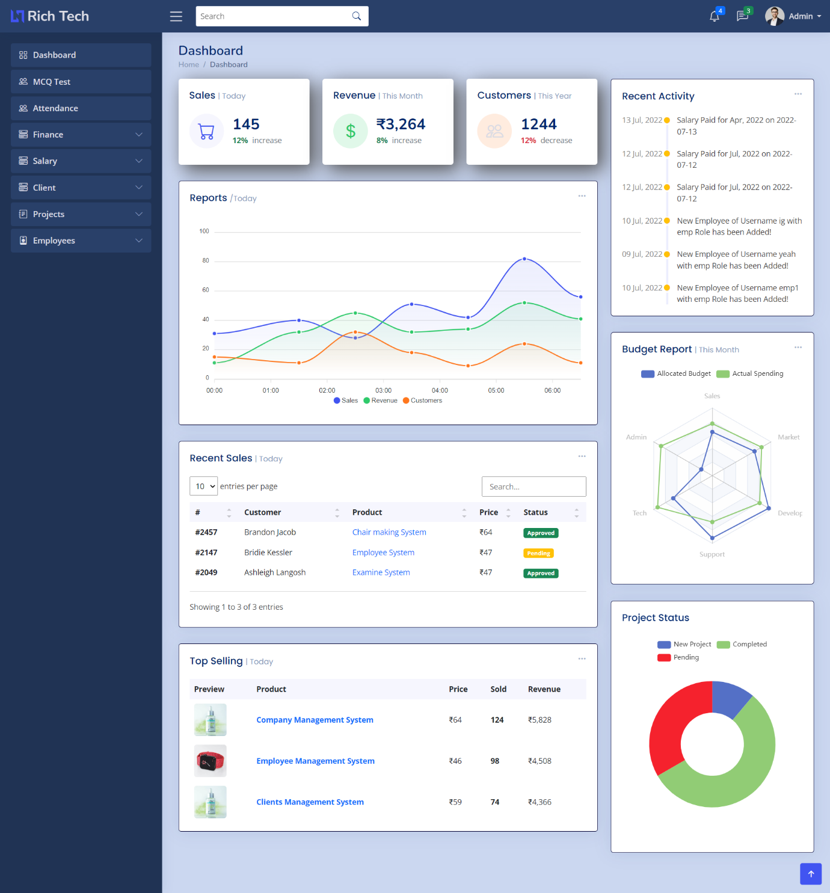
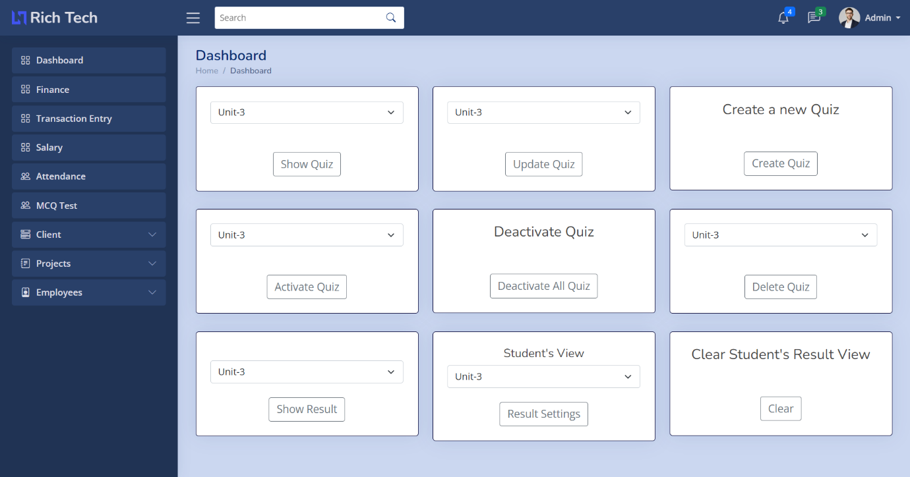
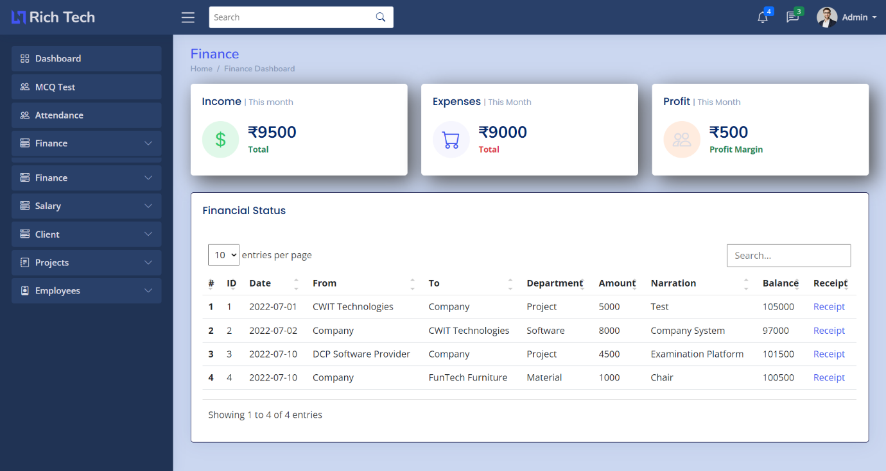
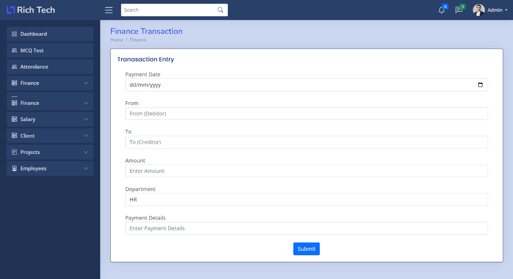
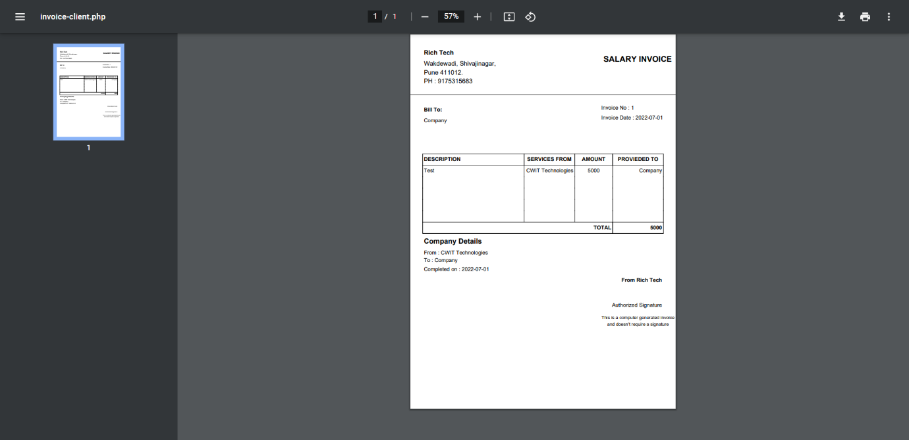
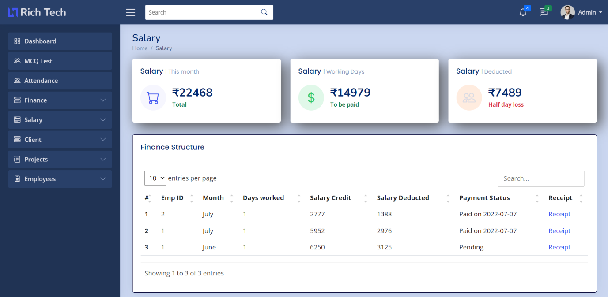
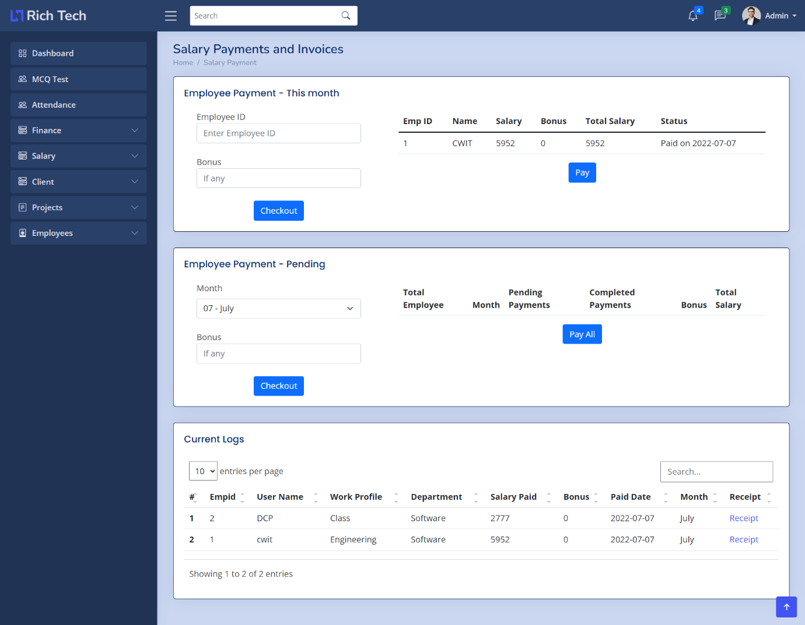
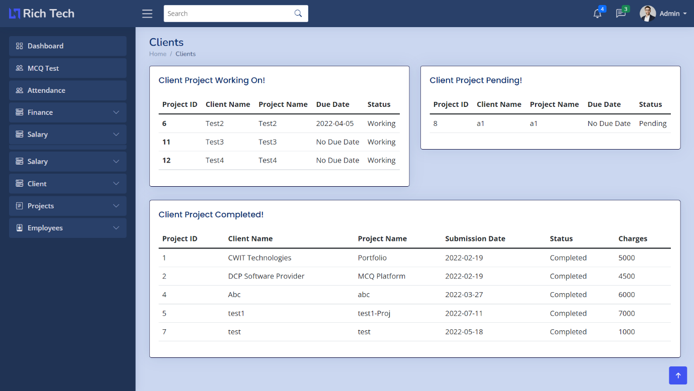
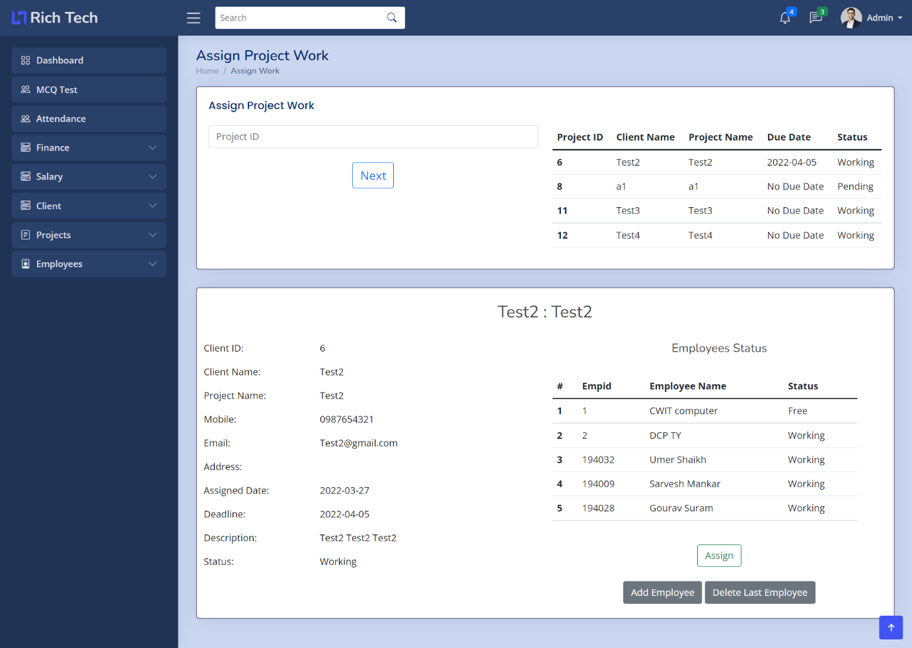

# Company Workflow Mapping System

## Abstract

The project will give the administrator the ability to add new employees, manage their work, add new client projects, assign work to employees, track employee attendance, manage project files and reports, manage salary, generate invoices and receipts, and more, making it possible to effectively manage the entire organisation with just one application.
 
For this reason, I created a unique company management system that can adapt to various managerial and daily routine requirements. Every organisation, large or little, has a variety of assets that need to be handled effectively in order to obtain maximum profits. This is intended to aid with strategic planning and will help you make sure that your company can accomplish its objectives. In the end, this strategy enables you to manage resources more effectively.

## Problem Statement

Any organisation, no matter how big or little, must manage several duties at once. All of those duties can be completed manually, but doing so is time-consuming and inefficient. Today, there is a demand for all tasks to be managed from a single, small workspace that will make it simple for an organisation to coordinate amongst various departments. Managing all the paper work is also a tough undertaking.
 
Running the daily operations of the business requires a better environment and workplace for each client as well as for each employee.
The company system provides all the characteristics needed by a business to carry out ongoing operations and establish a healing environment. The Company System's primary goal is to maintain a healthy workplace. 

## Features

- Employee Management
- Project Management
- Attendance Management
- Salary Management
- Invoice Management
- File Management
- Report Management
- Client Management
- Task Management
- Leave Management
- User Management
- Notice Management

## Technology Stack

- Frontend
    - HTML
    - CSS
    - JavaScript
    - Bootstrap
- Backend
    - PHP
    - MySQL

## Software Requirements

- XAMPP Server
- Any Browser (Chrome, Firefox, Edge, Safari, etc.)

## How to run this project?

1.) Install XAMPP. 
2.) Clone this repository in htdocs folder of XAMPP. 
3.) Start Apache and MySQL server. 
4.) Open phpMyAdmin and create a database named "database". 
5.) Import the mcq.sql file in the database. 
6.) Open any browser and type "localhost/MCQ-Examination". 

## Images

    

    

    

<!-- 

    

 -->

    

    

<!-- 

    

 -->

    

    

    

